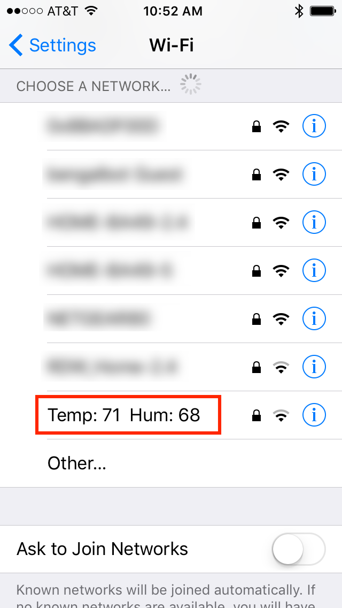
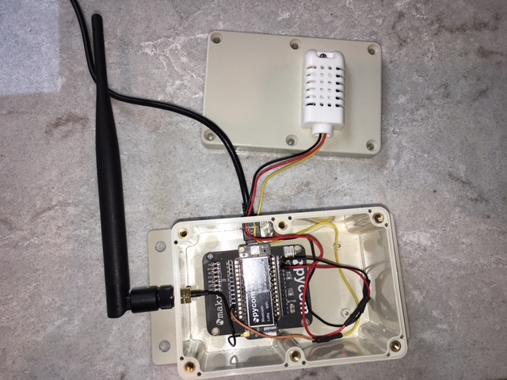
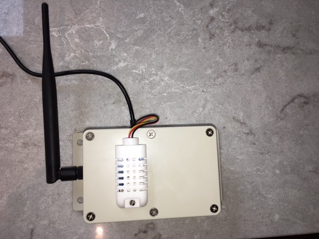

# SSID Weather

Broadcasts the current temperature and humidity as the SSID name.

Parts used:

* [Lopy](https://pycom.io/product/lopy/)
* [AM2302 (wired DHT22) temperature-humidity sensor](https://www.adafruit.com/product/393)
* [900Mhz Antenna Kit - For LoPy, LoRa](https://www.adafruit.com/product/3340)
* [ABS Junction Box Universal Electric Project Enclosure](http://a.co/4dTPCSh)
* USB Adapter and cable

---

